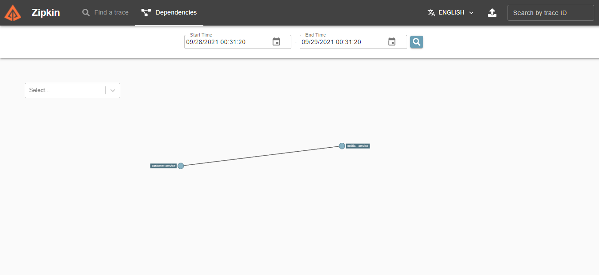

# Ödev Son Teslim Tarihi : 29 Eylül - Saat: 23:00


<h3 align="center">Welcome to Graduation Project</h3>

<details open="open">
  <summary>Table of Contents</summary>
  <ol>
    <li>
      <a href="#about-the-project">About The Project</a>
      <ul>
        <li><a href="#project-architecture">Project Architecture</a></li>
      </ul>
      <ul>
        <li><a href="#built-with">Built With</a></li>
      </ul>
    </li>
    <li>
     <a href="#installation">Installation</a>
    </li>
    <li>
      <a href="#usage">Usage</a>
    </li>
    <li>
      <a href="#todolist">To do List</a>
    </li>
    <li>
        <a href="#contributing">Contributing</a>
    </li>
    <li>
        <a href="#license">License</a>
    </li>
    <li>
        <a href = "#contact">Contact</a>
    </li>
  </ol>
</details>

## About The Project
<br/>
Writing a restful application for a credit application system, which will take the credit application requests and return the credit result to the customer according to the relevant criteria, using the Spring Boot framework
<br/>
<br/>

### Project Architecture
<br/>
<br/>


### Built With

* [JDK8+](https://www.oracle.com/java/technologies/javase/javase8u211-later-archive-downloads.html)
* [Lombok](https://projectlombok.org/)
* [Spring Cloud Gateway](https://spring.io/projects/spring-cloud-gateway#overview)
* [Zipkin](https://zipkin.io/)
* [Sleuth](https://spring.io/projects/spring-cloud-sleuth)
* [Resilience4j](https://resilience4j.readme.io/docs)
* [Spring Cloud Config](https://cloud.spring.io/spring-cloud-config/reference/html/)
* [Eureka Server](https://cloud.spring.io/spring-cloud-netflix/reference/html/)
* [Swagger](https://swagger.io/tools/swagger-ui/)
* [H2 Database](https://www.h2database.com/html/main.html)


## Installation
<br/>

**To run locally**

**1. Clone the application**

```shell
$ git clone https://github.com/113-GittiGidiyor-Java-Spring-Bootcamp/gittigidiyor-graduation-project-emredalci
$ cd gittigidiyor-graduation-project-emredalci
```
**2. Service Registry**

  ```shell
  $ cd service-registry
  $ mvn package
  $ java -jar target/service-registry-0.0.1-SNAPSHOT.jar
  ```
**2. Config Server**

  ```shell
  $ cd cloud-config-server
  $ mvn package
  $ java -jar target/cloud-config-server-0.0.1-SNAPSHOT.jar
  ```

**3. Cloud Gateway**

  ```shell
  $ cd cloud-gateway
  $ mvn package
  $ java -jar target/cloud-gateway-0.0.1-SNAPSHOT.jar
  ```

**4. Customer Service**

  ```shell
  $ cd customer-service
  $ mvn package
  $ java -jar target/customer-service-0.0.1-SNAPSHOT.jar
  ```

**4. Notification Service**

  ```shell
  $ cd notification-service
  $ mvn package
  $ java -jar target/notification-service-0.0.1-SNAPSHOT.jar
  ```

**5. Zipkin Server**
  ```shell
  $ java -jar zipkin-server-2.23.4-exec.jar
  ```

**To run with docker(under development)**
  ```shell
  $ docker-compose up
  ```


## Usage


**Endpoints**
<p>To see customer service details, please enter the following url on your web browser after run project</p>
<p>http://localhost:9001/swagger-ui.html</p>

<p>To see main task endpoint details please click blue texts below</p>

**Save customer**
* [Save Customer](doc/save-customer.md) : `POST http://localhost:9191/customer`

**Update Customer**
* [Update Customer](doc/update-customer.md) : `PUT http://localhost:9191/customer/{nationalId}`

**Delete Customer**
* [Delete Customer](doc/delete-customer.md) : `DELETE http://localhost:9191/customer/{nationalId}`

**Apply For Loan**
* [Apply For Loan](doc/apply-for-loan.md) : `GET http://localhost:9191/customer/{nationalId}`

**Credit Results by National id**
* [Credit Results](doc/credit-result.md) : `GET http://localhost:9191/result/{nationalId}`

<br/>
<br/>

| Request   | Route    | Body                       |  Description |
| :-------- | :------- | :------------------------- | :------------|
| POST      | /customer | {"firstName": "Emre","income": 3000,"lastName": "Dalcı","nationalId": 11111111111,"phoneNumber": "05391111111"} | Save Customer  |
| DELETE    | /customer/{nationalId} | EMPTY | Delete customer by national id  |
| PUT       | /customer/{nationalId} | {"firstName": "Emre","income": 3000,"lastName": "Dalcı","phoneNumber": "05391111111"} | Update customer by national id  |
| GET       | /customer/{nationalId} | EMPTY | Apply for loan by nationalId  |
| GET       | /result/{nationalId} | EMPTY | List all credit results by national id  |


**Service Endpoints**

<p>Gateway: http://localhost:9191</p>
<p>Config Server : http://localhost:9296</p>
<p>Service Registry : http://localhost:8761</p>
<p>Customer Service : http://localhost:9001</p>
<p>Notification Service : http://localhost:9002</p>

<br/>
<br/>


**Databases**

<p>All logs can be seen in relevant database</p>
<p>For customer service : http://localhost:9001/h2-console</p>
<p>For notification service : http://localhost:9002/h2-console</p>

<br/>


**Zipkin Screenshots**




## To Do List

* Docker needs to be improved
* Spring security can be added


## Contributing

Contributions are what make the open source community such an amazing place to learn, inspire, and create. Any contributions you make are **greatly appreciated**.

1. Fork the Project
2. Create your Feature Branch (`git checkout -b feature/AmazingFeature`)
3. Commit your Changes (`git commit -m 'Add some AmazingFeature'`)
4. Push to the Branch (`git push origin feature/AmazingFeature`)
5. Open a Pull Request

## License

Distributed under the MIT License. See `LICENSE` for more information.

## Contact

Emre Dalcı - [Linkedin](https://www.linkedin.com/in/emredalci/)

Project Link: [Github](https://github.com/113-GittiGidiyor-Java-Spring-Bootcamp/gittigidiyor-graduation-project-emredalci)
